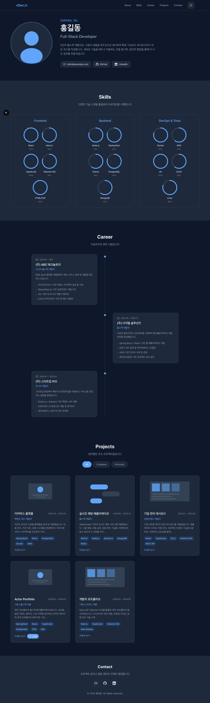

# Developer Portfolio

개발자 포트폴리오 웹사이트입니다.



## 기능

- 프로필 소개 (Hero 섹션)
- 기술 스택 (원형 차트 + 기술 로고)
- 경력 사항 (타임라인 형태)
- 프로젝트 (회사/개인 탭 필터링, Live/GitHub 링크)
- 다크/라이트 테마 토글
- 반응형 디자인

## 기술 스택

- **Framework**: Next.js (App Router)
- **Language**: TypeScript
- **Styling**: Tailwind CSS
- **Theme**: next-themes

## 실행 방법

```bash
npm install
npm run dev
```

[http://localhost:3000](http://localhost:3000)에서 확인할 수 있습니다.
