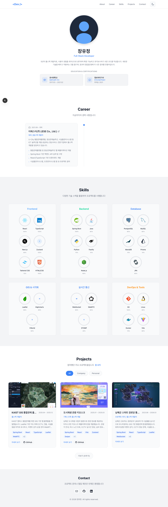
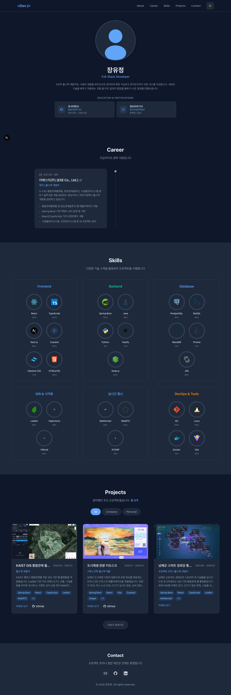

# Developer Portfolio

장유정의 개발자 포트폴리오 웹사이트입니다.

<div align="center">
  
  
</div>

## 주요 기능

- **Hero 섹션** — 프로필 소개 및 주요 링크
- **Skills** — 기술 스택 원형 차트 (6개 카테고리)
- **Career** — 경력 타임라인
- **Projects** — 회사/개인 탭 필터링, 모달 상세보기, 페이지별 탭 UI
- **다크/라이트 테마** 토글
- **반응형 디자인**

## 기술 스택

- **Framework**: Next.js 14 (App Router)
- **Language**: TypeScript
- **Styling**: Tailwind CSS
- **Theme**: next-themes

## 프로젝트 목록

### 회사 프로젝트
| 프로젝트 | 기간 | 역할 |
|---------|------|------|
| KAIST GIS 통합관제 플랫폼 | 2023.07 ~ 2024.02 | 풀스택 |
| 도시재생 관광 키오스크 | 2023.04 ~ 2023.07 | 풀스택 |
| 남해군 스마트 경로당 통합관제 플랫폼 | 2024.03 ~ 2025.03 | 풀스택 |
| 화성시 CCTV 민원관리 대시보드 | 2024.03 | 풀스택 (단독) |
| 경기도 통합관제 플랫폼 | 2022.04 ~ 2025.12 | 풀스택 (2인) |
| 화성특례시 스마트도시 통합관제 플랫폼 | 2024.04 ~ 2024.06 | 풀스택 (단독) |

### 개인 프로젝트
| 프로젝트 | 설명 |
|---------|------|
| KISA 취약점 점검 도구 | Claude AI 활용 |
| 주간보고서 작성기 | Claude AI 활용 |

## 실행 방법

```bash
npm install
npm run dev
```

[http://localhost:3000](http://localhost:3000)에서 확인할 수 있습니다.
